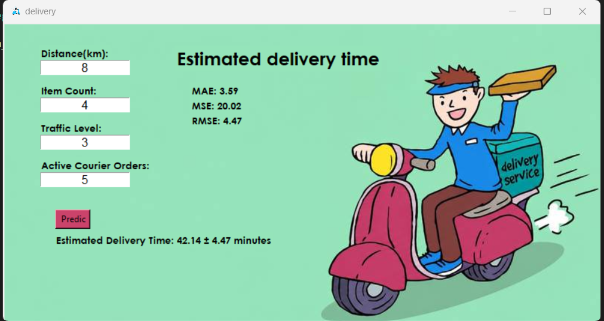

# Internet Order Delivery Time Prediction

## Project Overview

This project aims to **predict the delivery time of internet orders**
using information related to the order, delivery distance, traffic
conditions, and the number of active orders handled by couriers.

A **Regression** model from the `scikit-learn` library is used to
predict the delivery time.

------------------------------------------------------------------------

## Dataset

The dataset is stored in the `data.xlsx` file.

The dataset contains **1001 records** with the following input features:

  -----------------------------------------------------------------------
  Column                              Description
  ----------------------------------- -----------------------------------
  `Distance_km`                       Distance of the order destination
                                      in kilometers

  `Item_Count`                        Number of items in the order

  `Traffic_Level`                     Traffic level

  `Active_Courier_Orders`             Number of active orders assigned to
                                      couriers
  -----------------------------------------------------------------------

**20% of the data was used for testing**, while the remaining 80% was
used for training.

------------------------------------------------------------------------

## Problem Type and Model

This project is a **Regression problem** because the goal is to predict
a numerical value: the **delivery time of an order**.

The model was implemented using the `scikit-learn` library in Python.

### General Workflow

1.  Load the dataset from `data.xlsx`
2.  Select the input features
3.  Split the data into training and testing sets
4.  Train the regression model
5.  Predict the delivery time
6.  Evaluate the model using MAE, MSE, and RMSE

------------------------------------------------------------------------

## Model Evaluation Metrics

Three common regression metrics were used to evaluate the model:

### 1. MAE --- Mean Absolute Error

MAE calculates the average absolute difference between the actual and
predicted values.

Formula:

\[ MAE =
`\frac{1}{n}`{=tex}`\sum`{=tex}\_{i=1}\^{n}\|y_i-`\hat{y}`{=tex}\_i\| \]

Where:

-   (y_i) = actual value
-   (`\hat{y}`{=tex}\_i) = predicted value
-   \(n\) = number of test samples

**Result: 3.57**

This means that the average absolute difference between the actual and
predicted delivery times is approximately **3.57 time units**. The exact
time unit depends on the target variable in the dataset.

------------------------------------------------------------------------

### 2. MSE --- Mean Squared Error

MSE calculates the average of the squared prediction errors.

Formula:

\[ MSE =
`\frac{1}{n}`{=tex}`\sum`{=tex}\_{i=1}\^{n}(y_i-`\hat{y}`{=tex}\_i)\^2
\]

**Result: 19.84**

------------------------------------------------------------------------

### 3. RMSE --- Root Mean Squared Error

RMSE is the square root of MSE. Unlike MSE, RMSE is expressed in the
same unit as the target variable.

Formula:

\[ RMSE = `\sqrt{\frac{1}{n}\sum_{i=1}^{n}(y_i-\hat{y}_i)^2}`{=tex} \]

or:

\[ RMSE = `\sqrt{MSE}`{=tex} \]

**Result: 4.45**

------------------------------------------------------------------------

## Evaluation Results

  Metric     Formula                                                                           Result
  ---------- --------------------------------------------------------------- ------------------------
  **MAE**    (`\frac{1}{n}`{=tex}`\sum`{=tex}                                  y_i-`\hat{y}`{=tex}\_i
  **MSE**    (`\frac{1}{n}`{=tex}`\sum `{=tex}(y_i-`\hat{y}`{=tex}\_i)\^2)                  **19.84**
  **RMSE**   (`\sqrt{\frac{1}{n}\sum (y_i-\hat{y}_i)^2}`{=tex})                              **4.45**

### Brief Interpretation

-   **MAE = 3.57** means that the model's average absolute prediction
    error is 3.57 time units.
-   **MSE = 19.84** represents the average squared prediction error.
-   **RMSE = 4.45** indicates an average error magnitude of
    approximately 4.45 time units, with larger errors having a greater
    effect on the metric.

------------------------------------------------------------------------

## Software Output

The following image shows the output of the software and the model
results:



> Make sure that `output.png` is placed in the same directory as
> `README.md` so that the image is displayed correctly on GitHub or
> other Markdown viewers.

------------------------------------------------------------------------

## Project Structure

``` text
project/
│
├── data.xlsx
├── output.png
├── README.md
└── ...
```

------------------------------------------------------------------------

## Libraries Used

-   Python
-   Pandas
-   Scikit-learn

### Installation

``` bash
pip install pandas scikit-learn openpyxl
```

------------------------------------------------------------------------

## Conclusion

This project uses a **Regression model** to predict internet order
delivery time based on:

-   Distance
-   Number of items
-   Traffic level
-   Number of active courier orders

The dataset contains **1001 records**, with **80% used for training and
20% used for testing**.

The model achieved the following evaluation results:

  Metric        Result
  -------- -----------
  MAE         **3.57**
  MSE        **19.84**
  RMSE        **4.45**
